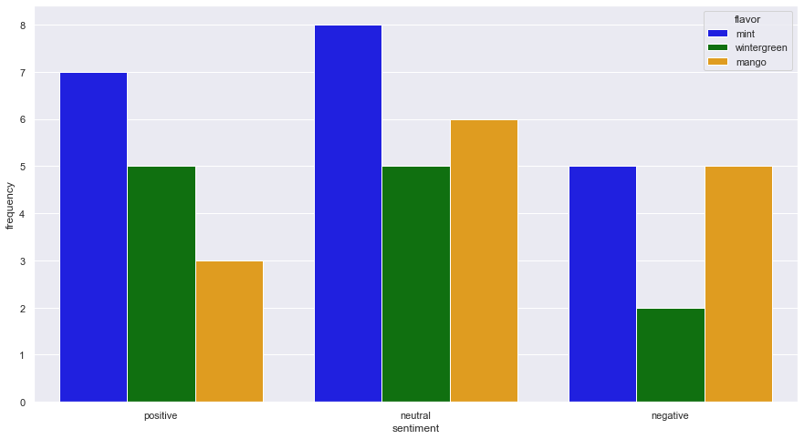

# Sesh Sentiment in Reddit Comments

To explore consumer sentiment on Sesh products, I performed an analysis on Reddit comments from the "r/NicotinePouches" community (in addition to other "subreddits") using traditional analytical techniques, as well as large-language-models for sentiment analysis.

This project represents a minimal-viable solution, and should be further expanded with additional data collection, as well as a validation on sentiment analysis. While *most* comments appear to be labeled accuratley, a few comment labels appear to be incorrect. This could potentially be due to the limited information provided to the GPT engine, but a further investigation should be done.

My findings include the following notable patterns:

* 2023 had a greater proportion of negative sentiment comments, while 2024 had a greater proportion of positive comments

* Mint was the most frequent flavor key-word across both 2023 and 2024, whereas wintergreen was the least frequent. 

* While Mint is the most frequent key-word to appear across all sentiments (positive, neutral, and negative), Mango was also the most common key-word in negative sentiment comments.

* Additionally, Mango was the most the most frequent key-word to appear in negative sentiment comments in 2024.

## Consumer Demographics

The demographics of reddit users include the following features (as pulled from [explodingtopics](https://explodingtopics.com/blog/reddit-users)):
* 44% are from 18-29 years old.
* 63.6% are male
* 48.33% are in the US

## Methodology

1. Automatically collect 109 Reddit links using the Google search-term `'site:reddit.com ""Sesh"" nicotine pouch'`. Convert each reddit link to a JSON file, and programmtically parse each comment to get 3389 comments.
2. Filter data to only include comments on Sesh nicotine pouches to get 242 comments.
3. Utilize the `openai` api to parse sentiment using the `gpt-4o` model to get 201 sentiment-labeled comments. These labels include `positive`, `negative`, `neutral`, and `irrelevant`. 

Further details on the prompt are described below

```
system:
    You are an expert that can detect nuance in text and determine when a human has positive, negative, neutral, or irrelevant sentiment towards the product "Sesh"
    nicotine pouches.
    Here is how you will make this determination:
    * positive: User had a positive experience with using "Sesh" nicotine pouches. They are satisfied with the product and have a few points (if not no) negative comments.
    * negative: User had a negative experience with using "Sesh" nicotine pouches. They prefer other products and find Sesh inferior.
    * neutral: User has an equal mix of both positive and negative feedback.
    * irrelevant: User is not commenting about the Sesh nicotine pouch product. They are not providing any feedback on the product itself.

user:
    What is the sentiment of this comment from Reddit on Sesh nicotine pouches?
    "{text}"

    Please respond using only one word.
"""

```

## Exploratory Trends

While the data preprocessing steps resulted in a small dataset of 201 samples, interesting outcomes were nonetheless discovered in this limited dataset. This should be followed up with a more comprehensive data filtering method to cpature more insight on consumer feedback on Sesh nicotine pouches.

### Sentiment Shifts Toward Positive From 2023 & 2024

**Differences in Sentiment 2023-2024**


After analyzing the corpus of comments, the following distribution of sentiments was discovered:
* 104 were marked as irrelevant (~52%)
* 42 were marked as positive (~21%)
* 30 were marked as neutral (~15%)
* 25 were marked as negative (~12%)

While both years had mostly irrelevant comments (~41% for 2023; ~58% for 2024), 2023 had a greater proportion of negative sentiment comments (20) (~28%), while 2024 saw greater proportion of positive sentiment comments (35) (~27%).

### Most Common Sesh Flavor Key-Words

**Flavor Frequency**


Overall mint was the most frequent flavor key-word (30), then mango (24), and finally wintergreen (19).

In 2023...
* Mint was the most frequent flavor key-word in negative sentiment comments (5)
* Wintergreen was the most frequent flavor key-word in positive sentiment comments (2)

**2023 Flavor Frequency in Negative Comments**


**2023 Flavor Frequency in Positive Comments**


In 2024...
* Mango was the most frequent (and only) flavor key-word in negative sentiment comments (2)
* Mint was the most frequent flavor key-word in positive sentiment comments (6)

**2024 Flavor Frequency in Negative Comments**


**2024 Flavor Frequency in Positive Comments**


### Differences in Flavor Key-Words Across Sentiments

**Flavors Across Different Sentiments**


While Mint was the most frequent key-word across positive (7), neutral (8), and negative (5) comments, mango was also prominent in negative comments and was as equally present as mint (5). 

## Prescriptions

* Highlight Mint as the Sesh "flagship flavor" during promotional and marketing campaigns.
* Investigate 2024 marketing changes to potentially explain shift in positive sentiment towards Sesh products, and continue to leverage current campaign features.
* Further investigate feedback on Mango Sesh flavor to discover customer satisfaction, and potentially reduce inventory of this flavor upon receiving feedback.